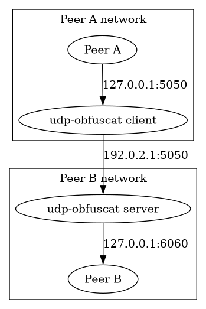

# udp-obfuscat

This is an UDP proxy with a simple xor cipher obfuscation in Rust.

## Help

```bash
Usage: udp-obfuscat [OPTIONS]

Options:
  -c, --config-path <config_path>
          Alternative toml config file
      --disable-timestamps
          Disable timestamps in log messages. By default they are enabled
  -l, --local-address <local_address>
          Where to bind listening client UDP socket
  -r, --remote-address <remote_address>
          Address of an udp-obfuscat server in client mode or UDP upstream in server mode
      --xor-key <xor_key>
          Base64-encoded key for a Xor filter
  -h, --help
          Print help
  -V, --version
          Print version
```

Options in command line override the same options from a file. Additional toml options:

- user - string, switch to this user when running as root to drop privileges;
- log_level - string, log level for env_logger. Takes same values as
  log::LevelFilter
  [enum](https://docs.rs/log/0.4.20/log/enum.LevelFilter.html).

## Examples

You can generate xor-key with openssl:

```bash
openssl rand -base64 16
```

### Client

```bash
$ RUST_LOG=trace cargo run -- -l 127.0.0.1:5050 -r 192.0.2.1:5050 --xor-key aaaa
```

### Server

```bash
$ RUST_LOG=trace cargo run -- -l 192.0.2.1:5050 -r 127.0.0.1:6060 --xor-key aaaa
```

Now on a client side packets sent to 127.0.0.1:5050 will be forwarded to
127.0.0.1:6060 on a server side.


